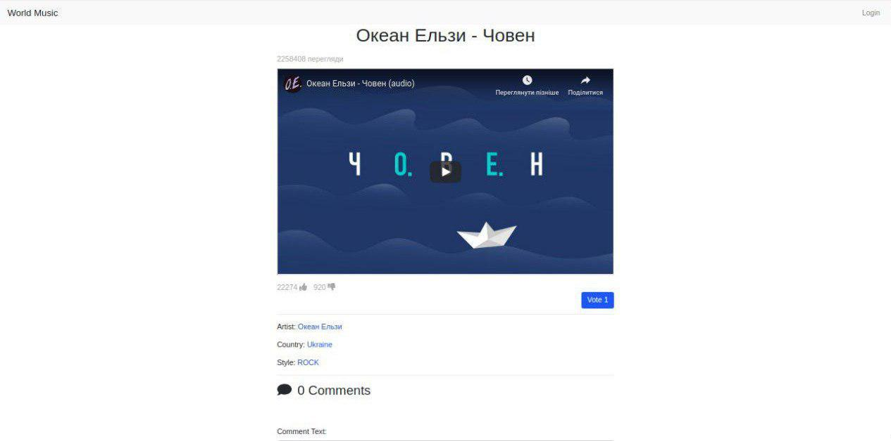
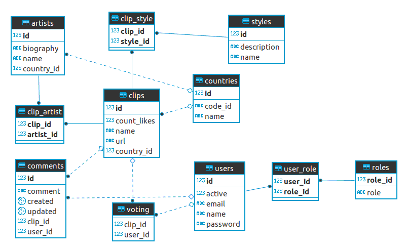

# World Music

[](https://app.codacy.com/app/VolodymyrBalamut/WorldMusic?utm_source=github.com&utm_medium=referral&utm_content=VolodymyrBalamut/WorldMusic&utm_campaign=Badge_Grade_Dashboard)

Музичний сайт *World Music* спрямований на формування музичних чартів по країнам. На сьогодні, найпопулярнішим відеохостингом у світі є _YouTube_, проте він не надає інформації користувачам про походження музичного кліпу. А музичні чарти, які він формує вираховується за принципом кількості переглядів кліпу у певній країні, не враховуючи приналежності або не приналежності артиста до чарту цієї країни. Через це ми спостерігаємо, що у багатьох країнах лідерами чартів є співаки інших держав. Як наслідок, власні співаки не можуть стати відомими.


---

## Налаштування

1. У файлі [countries.csv]("https://github.com/VolodymyrBalamut/WorldMusic/blob/master/countries.csv") містить список всіх країн. Для того, щоб його перенести у базу даних необхідно виконати наступний sql-скрипт. 
```sql92
CREATE TEMPORARY TABLE tempCountryLoad(
    CountryName varchar(200) null,
    Code varchar(200) null,
    CountryCode varchar(200) null,
    field1 varchar(200) null
);

COPY tempCountryLoad FROM '/tmp/countries.csv' WITH (FORMAT csv);

INSERT INTO countries(code_id,name) SELECT CountryCode,CountryName FROM tempCountryLoad WHERE CountryCode <> '\N' AND 
  not exists (SELECT * FROM countries a WHERE a.code_id=tempCountryLoad.CountryCode and a.name=tempCountryLoad.CountryName);
```
___
2. Необхідно додати ролі, виконавши наступний sql-скрипт.
```sql92
INSERT INTO public.roles(role_id, role)
    VALUES (1, 'ADMIN');

INSERT INTO public.roles(role_id, role)
    VALUES (2, 'USER');
```

ER-diagram:


